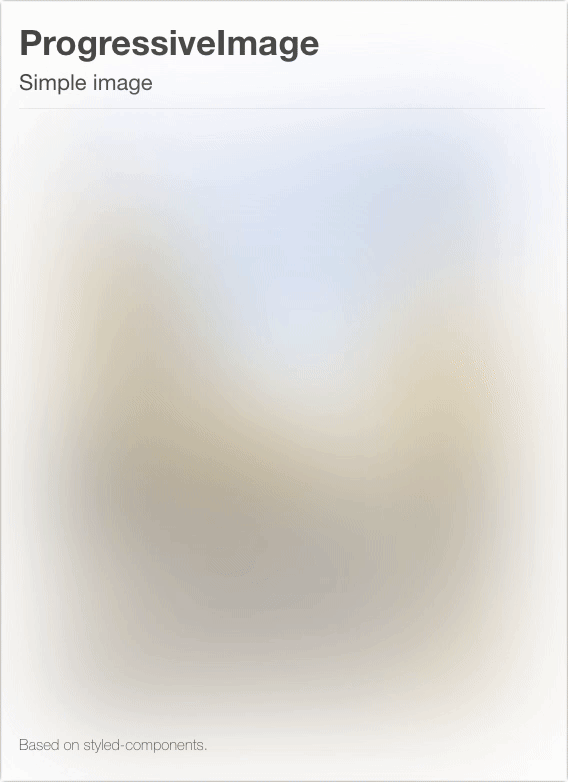

# react-progressive-bg-image

> Medium style progressive background image for React based on [Styled-components](https://github.com/styled-components/styled-components).

[![Travis][build-badge]][build]
[![Codecov Status][codecov-badge]][codecov]
[![npm package][npm-badge]][npm]
[![npm downloads][npm-downloads]][npm]

[![Dependency Status][dependency-badge]][dependency]
[![devDependency Status][devdependency-badge]][devdependency]
[![peerDependency Status][peerdependency-badge]][peerdependency]

[![prettier][prettier-badge]][prettier]
[![license][license-badge]][license]

## Demo

* https://react-progressive-bg-image.netlify.com/
* Responsive example: https://michaelhsu.tw/ [[Source code]](https://github.com/evenchange4/michaelhsu.tw/blob/master/src/components/CoverImage.js#L37-L44)
* Img tag example: https://mcslite.netlify.com/ [[Source code]](https://github.com/MCS-Lite/mcs-lite/blob/master/packages/mcs-lite-landing-web/src/components/BackgroundImage/BackgroundImage.js)



## Further Reading:

* [[English] Reproducing Medium Style Progressive Image Loading for React](https://medium.com/@evenchange4/reproducing-medium-style-progressive-image-loading-for-react-2e83bba0c608).
* [[中文] React Stack 開發體驗與優化策略](https://medium.com/@evenchange4/react-stack-%E9%96%8B%E7%99%BC%E9%AB%94%E9%A9%97%E8%88%87%E5%84%AA%E5%8C%96%E7%AD%96%E7%95%A5-b056da2fa0aa)

## Installation

```console
$ npm i react-progressive-bg-image styled-components --save
// or
$ yarn add react-progressive-bg-image styled-components
```

## Requirements

* node >= 9.4.0
* yarn >= 1.3.2

* react `^15.0.0 || ^16.0.0`,
* styled-components `^2.0.0`

## Usage

### Case 1: Inline-style

> Remind: May need to setup autoprefixer in your project.

```js
import ProgressiveImage from 'react-progressive-bg-image';

<ProgressiveImage
  src={image1}
  placeholder={image1X60}
  style={{
    height: 600,
    backgroundSize: 'contain',
    backgroundPosition: 'center center',
  }}
/>;
```

### Case 2: With Styled-components

```js
import styled from 'styled-components';
import ProgressiveImage from 'react-progressive-bg-image';

const StyledProgressiveImage = styled(ProgressiveImage)`
  height: 600px;
  background-size: contain;
  background-position: center center;
`;

<StyledProgressiveImage
  src={IMAGE}
  placeholder={IMAGEX60}
  transition="all 1s linear"
/>;
```

## Property

| **Prop**      | **Type** | **Required** | **Description**                     |
| ------------- | -------- | ------------ | ----------------------------------- |
| `src`         | string   | yes          | Origin image                        |
| `placeholder` | string   | yes          | Small image (Suggest inline base64) |
| `opacity`     | number   |              | default: 0.5                        |
| `blur`        | number   |              | default: 20                         |
| `scale`       | number   |              | default: 1                          |
| `transition`  | string   |              | default: 'opacity 0.3s linear'      |
| `component`   | string   |              | default: 'div'                      |

## Test

```
$ yarn run format
$ yarn run eslint
$ yarn run test:watch
```

## Github release / NPM release

```
$ npm version patch
$ git push
```

---

## Inspiration

* https://github.com/FormidableLabs/react-progressive-image
* [How Medium does progressive image loading](https://jmperezperez.com/medium-image-progressive-loading-placeholder/)

## CONTRIBUTING

* ⇄ Pull requests and ★ Stars are always welcome.
* For bugs and feature requests, please create an issue.
* Pull requests must be accompanied by passing automated tests (`$ yarn run test`).

## [CHANGELOG](CHANGELOG.md)

## [LICENSE](LICENSE)

MIT: [http://michaelhsu.mit-license.org](http://michaelhsu.mit-license.org)

[build-badge]: https://img.shields.io/travis/evenchange4/react-progressive-bg-image/master.svg?style=flat-square
[build]: https://travis-ci.org/evenchange4/react-progressive-bg-image
[npm-badge]: https://img.shields.io/npm/v/react-progressive-bg-image.svg?style=flat-square
[npm]: https://www.npmjs.org/package/react-progressive-bg-image
[codecov-badge]: https://img.shields.io/codecov/c/github/evenchange4/react-progressive-bg-image.svg?style=flat-square
[codecov]: https://codecov.io/github/evenchange4/react-progressive-bg-image?branch=master
[npm-downloads]: https://img.shields.io/npm/dt/react-progressive-bg-image.svg?style=flat-square
[license-badge]: https://img.shields.io/npm/l/react-progressive-bg-image.svg?style=flat-square
[license]: http://michaelhsu.mit-license.org/
[dependency-badge]: https://david-dm.org/evenchange4/react-progressive-bg-image.svg?style=flat-square
[dependency]: https://david-dm.org/evenchange4/react-progressive-bg-image
[devdependency-badge]: https://david-dm.org/evenchange4/react-progressive-bg-image/dev-status.svg?style=flat-square
[devdependency]: https://david-dm.org/evenchange4/react-progressive-bg-image#info=devDependencies
[peerdependency-badge]: https://david-dm.org/evenchange4/react-progressive-bg-image/peer-status.svg?style=flat-square
[peerdependency]: https://david-dm.org/evenchange4/react-progressive-bg-image#info=peerDependencies
[prettier-badge]: https://img.shields.io/badge/styled_with-prettier-ff69b4.svg?style=flat-square
[prettier]: https://github.com/prettier/prettier
